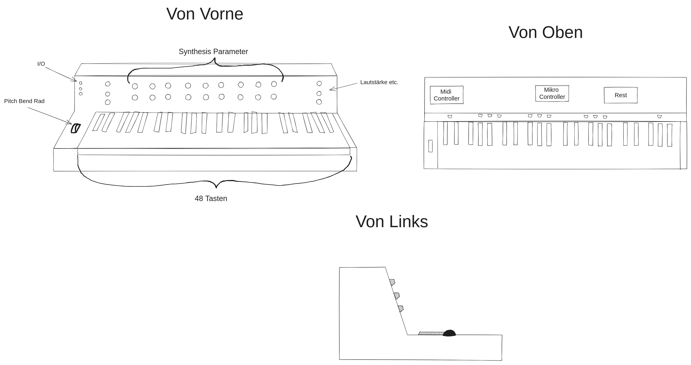
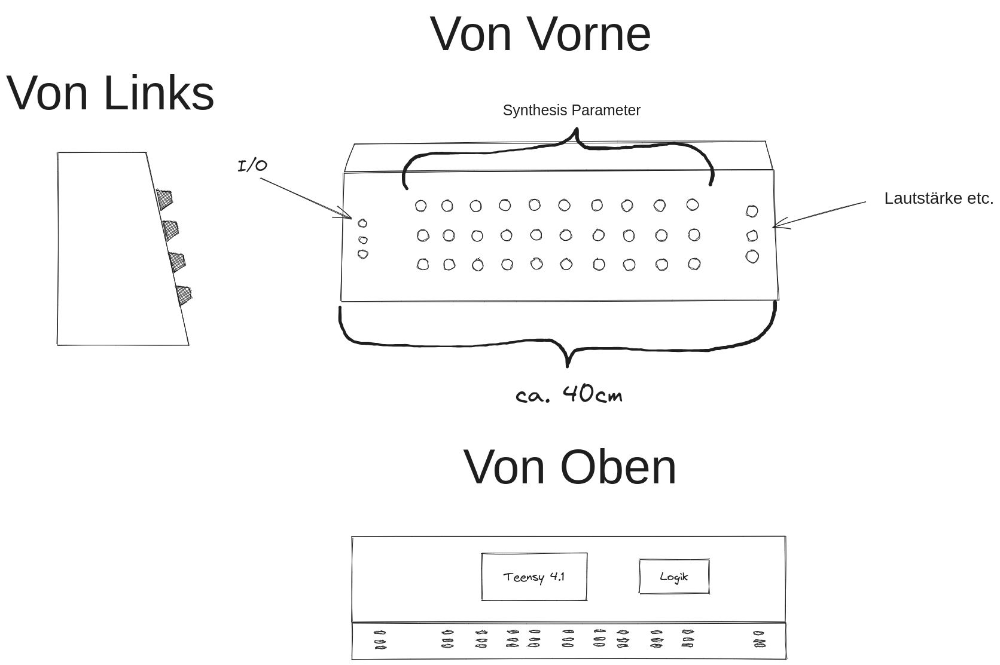

### Von was gehe ich aus

Folgende Ressourcen werde ich verwenden um den Synthesizer zu bauen:
 -  Software
	 - Arduino IDE
	 - [Teensy Audio Library](https://www.pjrc.com/teensy/td_libs_Audio.html)
	 - ([Faust (TAL erweiterung)]([faust2[...] Tools - Faust Documentation](https://faustdoc.grame.fr/manual/tools/#faust2teensy)))
 -  Hardware
	 -  Synthesizer [Bauteile](Digital_Materialliste.md)
	 -  Gebrauchtes Keyboard: für Tasten, Midi und Pitch Bend Rad  
	 -  Holz für das Case

### Was will ich erreichen
Ich will einen digitalen Synthesizer bauen, welcher einem modernen subtraktivem Synthesizer, bei den wichtigsten Funktionen in nichts nachsteht. D.h. mehrere Oszillatoren, Filter, Artikulationsmöglichkeiten und Effekte
### Skizzen

 

### Was zu tun ist
[Schritte](Schritte.md)

### Materialliste
[Digital](Digital_Materialliste.md)

### Falls noch Zeit bleibt
[Extras](Extras.md)

[Links](Links.md)
